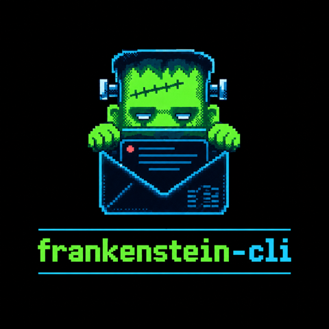

<p align="center">
  
</p>

<h1 align="center">frankenstein</h1>

> **Work in progress.** This is early and incomplete. There are no releases,
> nothing here is stable, and things will break without notice. Expect bugs.
>
> It is not a demo against a sandbox: it talks to your live mailbox. Archiving,
> trashing, labelling and sending are real Proton actions and they follow you
> to the web and mobile apps, so a mistake here is a real mistake. Do not trust
> it as your only mail client.

A terminal email client, your mail in Proton and your calendar in Google, with
notes, todos, habits, time tracking and a journal kept locally alongside them.

One Go binary. A full-screen TUI, a scriptable CLI, and `--json` on every
command so an agent can drive it.

```
─────────────────────────────────────────── frankenstein ──────────────────────── you@example.com ──
                                       Mail  Calendar  Notes
────────────────────────────────────────────── Inbox ───────────────────────────────────────────────
                1 Inbox (1)  2 Starred  3 Archive  4 Sent  5 Drafts  6 Spam  7 Trash
                           All  Primary  Social  Promotions  Newsletters

┃ YT  Yuki Tanaka                 09:41  │   Yuki Tanaka <yuki@example.com>                ☆  09:41
┃     Re: contract review, one mor...    │   to you@example.com  ·  Mon, 31 Aug 2026 09:41
┃ PR  Priya Raman                 08:15  │  ────────────────────────────────────────────────────────
┃     Thursday still good?               │
┃ SO  Sam Okonkwo             Sat 13:41  │   Sorry to keep going on about this, but clause 4 still
┃     [4] Photos from the weekend     ∗  │   reads as though the notice period runs from signature
┃ BI  Building Inspector      Sat 09:41  │   rather than from delivery.
┃     Certificate issued for 14 Ro...    │
┃ DD  Dev Digest              Fri 09:41  │   If that is deliberate, say so and I will stop asking.
┃     Weekly: the state of Go 1.26       │
┃ H   Hosting                 Thu 09:41  │   Yuki
┃     [2] Your October invoice           │
┃                                        │
┃                                        │                         ↩ reply  ↩↩ reply all  ↪ forward

────────────────────────────────────────────────────────────────────────────────────────────────────
 synced 6 conversations
 j/k navigate · enter open · 1-9 box · [/] category · tab section · / filter · space select
 ctrl+a all · c compose · r reply · f forward · v move · e seen · u unseen · s star
 a archive · t trash · ! spam · ? help · q quit
```

Real output, not a mock: the renderer drawing the fake mailbox the tests use.
The bar down the left of a pane says which one the keys are driving, and the
list is in date order, newest first, whether or not a message has been read.

## The idea

Your mailbox, as it already is. The boxes are your real Proton folders and
labels, and every action here is a real Proton action, so anything you do
follows you to the web and mobile apps.

The point is the client, not a filing system: mail is held in a local cache so
listing is instant and works on a plane, and the same commands that draw the
interface are scriptable and speak `--json`.

## Install

There are no tagged releases yet, so there is nothing packaged to install.
Build it yourself.

**With Go**

```sh
go install github.com/mhrsntrk/frankenstein-cli/cmd/frankenstein@latest
```

**From source**

```sh
git clone https://github.com/mhrsntrk/frankenstein-cli
cd frankenstein-cli
make build      # writes ./frankenstein in the working directory
make install    # or install it into $(go env GOPATH)/bin
```

Go 1.26.1 or newer, which is what `go.mod` asks for.

`make install` and `go install` both put the binary in `$(go env GOPATH)/bin`,
so that directory has to be on your `PATH`.

Neither carries man pages or completions: both ship a bare binary. Those are
generated by `make docs` into `.gen/`, and packaged installs will carry them.
Homebrew, AUR and `.deb`/`.rpm`/`.apk` packages are configured in
`.goreleaser.yaml` and will follow the first tagged release.

### First run

From a fresh clone to a mailbox on screen. The paths below are the Linux ones;
on macOS the config directory is `~/Library/Application Support/frankenstein`.

```sh
# 1. build
make build

# 2. set app_version yourself. There is no default and this is not optional.
mkdir -p ~/.config/frankenstein
echo '{"app_version": "macos-bridge@3.26.0"}' > ~/.config/frankenstein/config.json

# 3. log in. A CAPTCHA in a browser the first time.
./frankenstein login

# 4. fill the local cache
./frankenstein sync

# 5.
./frankenstein tui
```

Step 2 decides how this tool presents itself to Proton, which is a decision
about your account rather than a setting, so read [Identifying to
Proton](#identifying-to-proton) below before you run it. Until it is set,
`login` refuses up front and prints the config path and the line to add.
`linux-bridge@3.26.0` works as well as the macOS one; neither is tied to the
machine you are on.

Step 4 can be skipped: the TUI syncs on startup by itself, and `r` syncs again.
Run `frankenstein sync` when you want the cache warmed for the CLI without
opening the interface, and `frankenstein sync --watch` to keep it warm in the
background.

The calendar is a separate, optional step. It needs a Google OAuth client of
your own, which takes about five minutes to create. Notes, todos, habits, time
tracking and the journal are local and need none of it:

```sh
frankenstein calendar setup
```

The command walks you through it. [docs/calendar-setup.md](docs/calendar-setup.md)
is the same thing written down, including why the client is yours rather than
one shipped with the binary.

### A note for Linux

Credentials go to the system keyring through the D-Bus Secret Service, which
means something has to be providing it: `gnome-keyring`, `kwallet` or
`keepassxc` all work. Omarchy ships with one running.

Without a provider nothing breaks. The session falls back to a `0600` file at
`credentials.json` in the config directory. To see which one is in use:

```sh
frankenstein whoami
```

## Identifying to Proton

**This has to be set before the first login, and the tool ships without it.**

Proton's API refuses any client identifier that is not one of its own. The
library's default gets `400 Platform 'go' is not valid`, and there is no
third-party identity to register. So the only values that work are the names of
Proton's own applications, and sending one means presenting to Proton as
software this is not. Their terms do not permit that, and the account at risk
is yours, not this project's.

That is a decision about your own account, so it is left to you rather than
shipped as a default. To opt in, put an `app_version` in the config file:

```json
{"app_version": "macos-bridge@3.26.0"}
```

The config file is at:

| | |
|---|---|
| Linux | `~/.config/frankenstein/config.json` |
| macOS | `~/Library/Application Support/frankenstein/config.json` |

`frankenstein login` refuses up front when it is unset, and prints the path and
the line to add.

Proton also retires old client versions. When that happens the API answers
`422 code 5003`, and the fix is to set `app_version` to a current release.
The value is yours and so is keeping it current.

## Configuration

The config file is JSON, is written by `frankenstein login` and
`frankenstein calendar setup`, and is safe to edit by hand. Everything in it is
optional except `app_version`.

| Key | |
|---|---|
| `app_version` | the `x-pm-appversion` header sent to Proton. No default; see above |
| `api_host` | Proton's API root. Defaults to `https://mail.proton.me/api` |
| `username` | remembered so `login` only prompts for secrets |
| `body_cache_size` | how many decrypted message bodies to keep. Defaults to 500 |
| `sync_interval` | how often `sync --watch` polls, in seconds. Defaults to 30 |
| `calendar.client_id`, `calendar.client_secret` | your Google OAuth client |
| `calendar.calendar_id` | the calendar new events are written to. Defaults to `primary` |
| `calendar.calendar_ids` | the calendars drawn in the TUI. Empty means just `calendar_id` |

The Google OAuth token and the Proton session are not in here. They live in the
system keyring.

### Where things are

| | |
|---|---|
| Config, and the credentials fallback | `~/.config/frankenstein/` on Linux, `~/Library/Application Support/frankenstein/` on macOS |
| Cache, notes and journal | `~/.local/share/frankenstein/` on both |

The config directory follows `XDG_CONFIG_HOME` on Linux; macOS ignores it, the
way Go's `os.UserConfigDir` does. The data directory follows
`FRANKENSTEIN_DATA_DIR`, then `XDG_DATA_HOME`, on both.

Inside the data directory: `cache.db` is the SQLite cache, `notes/` holds quick
notes and `journal/` holds journal entries, both as markdown files you can read
and grep without this tool.

## The TUI

Everything happens here. Press `?` for the full list.

| Keys | |
|---|---|
| `j` `k` `enter` `esc` | move, open, back |
| `g` `G` | top, bottom |
| `ctrl+d` `ctrl+u` | half a page down, half a page up |
| `1`-`9` | jump straight to a box |
| `[` `]` | previous, next inbox category |
| `tab` `shift+tab` | Mail, Calendar, Notes |
| `c` `r` `R` `f` | compose, reply, reply all, forward |
| `space` `ctrl+a` | select a thread, select all |
| `e` `u` `s` | mark read, unread, star |
| `a` `t` `!` `v` | archive, trash, spam, move |
| `/` | filter |
| `?` `q` | help, quit |
| click | move the cursor, click again to open |
| wheel | scroll without moving the cursor |

`r` replies inside a thread and syncs in a list.

The row under the box bar is the inbox category sub-row: Proton sorts incoming
mail into Primary, Social, Promotions, Newsletters, Updates and Forums, and
`[` and `]` cycle through them. `All` clears the filter. The row only appears
in the Inbox, because a category narrows that one listing.

The thread list is strictly newest first. Unread threads are highlighted but
are not floated to the top, so the order never changes under you as things are
read.

**In the composer**

| Keys | |
|---|---|
| `tab` | next field |
| `ctrl+d` | send |
| `ctrl+s` | save as a draft |
| `esc` | minimize to a bar, without losing what is typed |

**In Notes**

| Keys | |
|---|---|
| `n` `enter` `e` | new, read, edit |
| `D` `r` | delete, reload |
| `ctrl+d` `esc` | in the editor: save, discard |

**In Calendar**

| Keys | |
|---|---|
| `1` `2` `3` | day, week, year |
| `p` `n` `t` | back, forward, today |
| `c` `enter` `e` `D` | new event, read, edit, delete |
| `b` `s` `g` | habits, todos, which calendars are shown |

Actions apply to your selection, or to the row under the cursor when nothing is
selected, so bulk operations need no separate commands.

## The CLI

Every command below takes `--json`.

```sh
frankenstein boxes                       # mailboxes and counts
frankenstein threads --box Inbox         # recent threads
frankenstein box Inbox                   # a named box, without the flag
frankenstein thread <id>                 # messages in a thread
frankenstein read <message-id>           # one message, decrypted

frankenstein compose --to a@b.com -s "Hi" --body "..."
frankenstein reply <message-id> --body "..." --send
frankenstein drafts
frankenstein send <draft-id>

frankenstein label <id> Archive          # add a label, --remove takes it off

frankenstein sync                        # fill the cache, --watch to keep going
frankenstein newsletters                 # volume, unread, trackers, routing

frankenstein calendar setup                # once, needs your own Google client
frankenstein calendar list                 # check the APIs are enabled
frankenstein calendar events --days 7
frankenstein calendar add "Standup" --start "09:30" --for 30m

frankenstein notes list                  # local markdown notes
frankenstein notes new "Release checklist"
frankenstein todo add "Renew domain" --due "friday 17:00"   # local, no Google
frankenstein todo list
frankenstein habit check read
frankenstein time start frankenstein
frankenstein journal write "..." --title "Today"
```

### For agents

```sh
frankenstein skill install
```

Writes a skill to `~/.claude/skills/frankenstein/` describing the command
surface, the safety rules (never `--send` unprompted, never file mail
unasked) and the traps.

## How it works

**Mail is a warm cache, not a mirror.** A SQLite index holds boxes,
conversations and message headers; bodies are fetched on demand and evicted by
last access. The TUI reads only the cache and never touches the network on a
render path. `frankenstein sync` fills it, then follows Proton's event stream
incrementally.

**Threads are Proton conversations**, not headers reassembled from
`References`. That is why this talks to Proton's API directly rather than going
through Bridge and IMAP.

**Provider interfaces live in their own package.** Nothing in the TUI or the
command layer imports a Proton type, which CI enforces as a build failure
rather than a review comment; a second mail backend is a matter of implementing
`mail.Provider`, and `internal/mail/fake` proves it by backing the whole test
suite. The Google side is not held to that line: `internal/cli/calendar.go` and
`internal/cli/auth.go` both import `internal/calendar/google` directly.

Every package in the tree, which is the whole of it:

```
cmd/frankenstein           the binary, and nothing but a main()
internal/cli               the Cobra command tree and the --json encoding
internal/tui               Bubble Tea client
internal/tui/render        the terminal rendering copied from hey-cli: the style
                           set, the theme, the nav chrome and the calendar grids
internal/tui/render/habit  habit icon and colour values, copied with it
internal/mail              provider-neutral model and the Provider interface
internal/mail/protonmail   the Proton adapter, the only place Proton types exist
internal/mail/fake         in-memory provider the test suite runs against
internal/protonapi         the Proton endpoints go-proton-api does not model
internal/auth              SRP login, human verification, key unlock, the session
internal/store             SQLite warm cache
internal/sync              backfill, then incremental event deltas
internal/calendar          provider-neutral calendar model
internal/calendar/google   the Google adapter and the OAuth loopback flow
internal/personal          notes, todos, habits, time tracking, journal
internal/when              the dates and times a person types at a terminal
internal/skill             the embedded agent skill and its installer
internal/terminal          escape-sequence stripping for text from elsewhere
internal/config            the on-disk layout and the config file
```

## Talking to Proton

Two API clients share one session.

[`ProtonMail/go-proton-api`](https://github.com/ProtonMail/go-proton-api) is
used unmodified, as a normal dependency, for authentication, human
verification, key unlocking, decryption, attachments, labels, drafts and
sending.

`internal/protonapi` is a small client of our own for the endpoints upstream
does not model. Upstream exists to serve Proton Bridge, which flattens
everything down to IMAP, and IMAP has no thread primitive, so the conversation
surface was never needed there. Its request methods are unexported, so those
endpoints cannot be added from outside the package. But the authenticated
session hands back a UID and an access token, which is all they need.

What it covers, all verified against the live API:

- **Conversations**: list, one thread with its messages, per-label counts, and
  the label / unlabel / read / unread actions.
- **Newsletter subscriptions**, read only: engagement counts, tracker counts,
  unsubscribe methods, and the server-side `MoveToFolder` / `MarkAsRead` rules
  as Proton reports them. Nothing here writes them back.
- **Event deltas**, including the `Conversations` array upstream drops, so
  thread sync needs no extra polling.
- The message fields upstream's struct discards: `ConversationID`,
  `CategoryID`, `NewsletterSubscriptionID`, `Order`, `IsProton`,
  `IsSimpleLogin`, `SpamScore`, `SnoozeTime`.
- Label constants 15 and 16, and the category labels 20-26, which
  `/core/v4/labels` never returns.

`docs/calendar-setup.md` covers the Google side: which scopes are used, and why
the OAuth client is yours rather than one shipped with the binary.

`docs/proton-api-findings.md` is the evidence behind all of that, including
which category ID means what and how it was determined.

One gotcha if you depend on go-proton-api yourself: it carries a `replace`
pointing at a Proton fork of resty, and Go ignores `replace` directives from
dependency modules. Copy it into your own `go.mod` or the upstream package will
not compile.

## Two things to know before you use this

**It has to identify as one of Proton's own clients.** There is no
third-party identity to register, so the `x-pm-appversion` header has to name
software this is not. Nothing is shipped as a default; you set it yourself and
you decide whether to. [Identifying to Proton](#identifying-to-proton) has the
detail.

`go-proton-api` is MIT, but it is published by Proton AG for their own clients.
Third-party use is a grey area. This is a personal tool and its author finds
that an acceptable risk; decide for yourself.

**First login needs a CAPTCHA.** Proton answers a fresh login with
`422 code 9001`. `frankenstein login` prints a `verify.proton.me` URL, waits
for you to solve it in a browser, and continues. Bridge does the same thing.
The session then lives in your system keyring, so this happens once.

## Privacy

Everything is local. There is no server, no telemetry, and nothing between you
and your providers.

- The session and the derived key passphrase live in your system keyring, with
  a `0600` file fallback at `credentials.json` in the config directory where no
  keyring exists.
- The cache is a SQLite file at `cache.db` in the data directory. Message
  bodies are decrypted into it as you read them and evicted by last access;
  `body_cache_size` in the config controls how many are kept. Delete the file
  whenever you like.
- `frankenstein logout` clears both the Proton session and the Google token,
  and deliberately leaves the cache alone so removing it stays your decision.

## Development

```sh
make build      # build the binary
make test       # run the tests
make check      # every check CI runs
make snapshot   # build every release artifact locally, publish nothing
```

What CI runs: formatting, `go vet`, `go test -race`, `go build ./...` and the
provider-boundary check, on both Linux and macOS, plus staticcheck over
everything except the packages copied from hey-cli. `make check` mirrors that
list, and the staticcheck version and skip list are pinned in the Makefile so
both run the same checker over the same packages.

The test suite runs against `internal/mail/fake`, so it needs no Proton
account. It covers the cache round-trips and eviction, the sync loop including
resync, the API decoding against captured payloads, and the TUI by driving real
key events through the real update loop.

To look at the interface without a terminal:

```sh
DUMP_VIEW=1 go test ./internal/tui -run TestDump -v
```

## Status

Work in progress. A personal project, best effort, well before 1.0, and the
first thing to say about it is that it is not finished.

What that means concretely:

- **No releases.** Nothing is tagged and nothing is packaged. Building it
  yourself is the only way to run it.
- **No stable surface.** Command names, flags, keys, the `--json` shapes and
  the cache schema all change without ceremony and without a migration.
- **Bugs.** Some are known, more are not. There is no support commitment and no
  promise about how quickly anything gets looked at.
- **Live mail.** Every action goes to your real mailbox. Keep another client
  you trust.

What has been exercised against a real Proton account, rather than only against
the fake provider: login with two-factor and human verification, sync, reading
and decrypting, composing, sending, and labelling. That is not the same as
being tested, and none of it has been run by anyone but the author.

Releases are cut by tagging; see [RELEASING.md](RELEASING.md). None has been
cut yet, so the packaging in `.goreleaser.yaml` is configured and unproven.

## Contributing

Issues and pull requests are welcome. A few things worth knowing:

- Only `internal/mail/protonmail` and `internal/auth` may import a Proton type.
  The provider interface is the point of the design, and CI fails the build
  over it. `internal/protonapi` is not on that list and does not need to be: it
  speaks HTTP with its own types and imports nothing from `go-proton-api`.
- Every command supports `--json`. A command without it is a bug, not an
  omission.
- Nothing in a TUI render path may touch the network.
- Read `docs/proton-api-findings.md` before changing `internal/protonapi`. The
  API rejects several plausible-looking parameters, and the reasons are
  recorded there rather than rediscovered.

## Credit

The terminal rendering is [**basecamp/hey-cli**](https://github.com/basecamp/hey-cli)'s.
Whole files are copied from it into `internal/tui/render`, `internal/tui/render/habit` and
`internal/terminal`, verbatim where practical so they stay diffable against
upstream, and they carry 37signals' copyright: the style set, the theme
loading, the width measurement, the nav chrome, and the 59KB of day, week and
year calendar grids in `internal/tui/render/calendar_views.go`. [NOTICE](NOTICE)
lists every file and every deliberate change to one.

The command tree, the Bubble Tea navigation model, the `--json`-everywhere
convention and the embedded skill packaging follow hey-cli too, which is MIT
licensed and is the reason this project exists. The API client is entirely
different, and hey-cli's workflow is gone: the screener, the Imbox, the Feed
and the Paper Trail have all been removed. HEY and those names are creations of
37signals. This project is not affiliated with, endorsed by, or supported by
[37signals](https://37signals.com).

Mail is powered by [**Proton Mail**](https://proton.me) through
[`go-proton-api`](https://github.com/ProtonMail/go-proton-api),
[`gopenpgp`](https://github.com/ProtonMail/gopenpgp) and
[`go-crypto`](https://github.com/ProtonMail/go-crypto), all published by Proton
AG. This project is an independent client and is not affiliated with, endorsed
by, or supported by Proton AG. Please do not raise issues about it with them.

The calendar uses Google Calendar. Notes, todos, habits, time tracking and the
journal are local. Built with
[Bubble Tea](https://github.com/charmbracelet/bubbletea),
[Cobra](https://github.com/spf13/cobra) and
[modernc.org/sqlite](https://modernc.org/sqlite).

## Licence

MIT. See [LICENSE](LICENSE).
